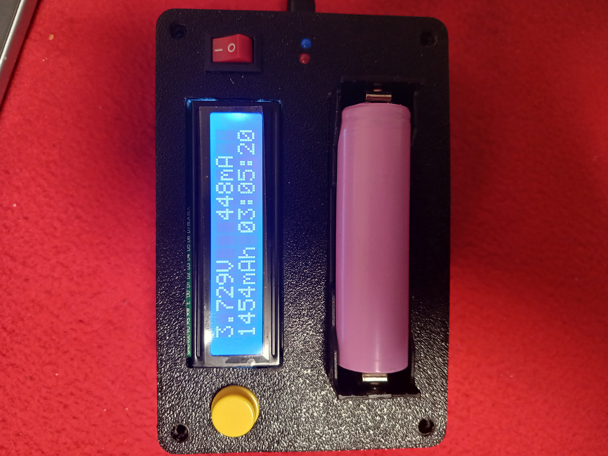
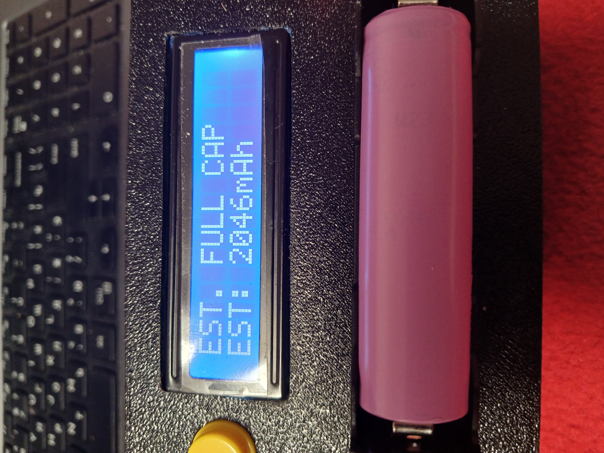
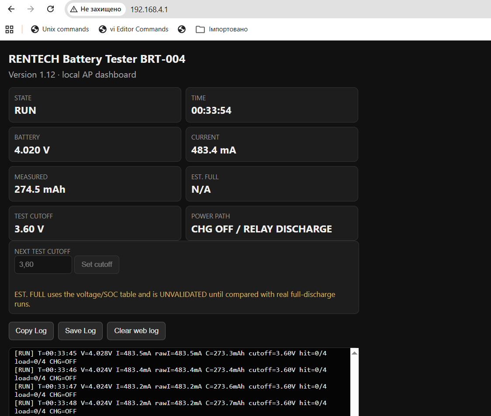
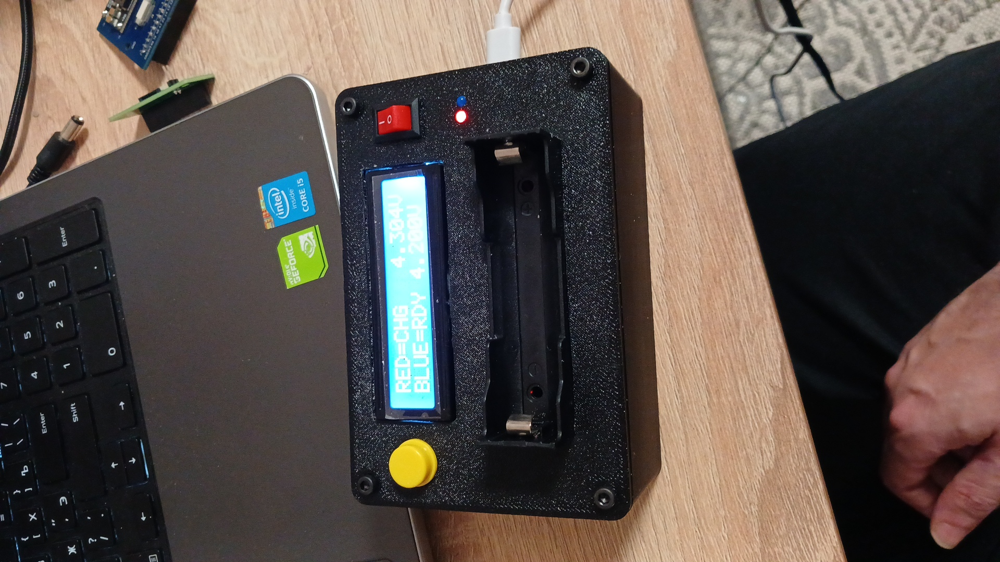
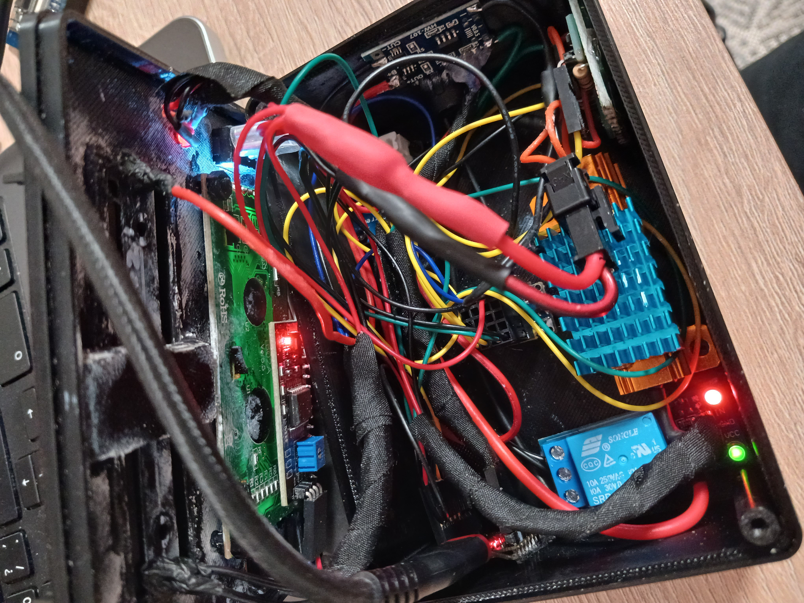

# RENTECH RT-004 Battery Capacity Tester
## Firmware v1.13

<p align="center">
  
</p>

<p align="center">
  
  
</p>

> **Примітка до скриншота:** діагностичний скриншот веб-панелі зроблено на firmware v1.12, тому на ньому ще видно стару ідентифікацію `BRT-004`. У v1.13 назву пристрою нормалізовано до `RT-004` у LCD/web/AP/log/files. Логіка панелі та вимірювання, показані на скриншоті, є тією самою гілкою, з якої випущено v1.13.
<p align="center">
  
  
  
</p>
---

# 🇺🇦 Українська
Слава Україні, козацтво!
## Що це

**RENTECH RT-004** — DIY-прилад для вимірювання ємності однокоміркових Li-ion акумуляторів методом контрольованого розряду через резистивне навантаження.

Проєкт виріс із конструкції, опублікованої Arduino.ua, але ця реалізація була суттєво перероблена під **ESP32-C3 Super Mini** та доповнена власною логікою керування живленням, перевірками безпеки тестового тракту, configurable cutoff, журналюванням і локальною Wi-Fi панеллю.

**Джерело / оригінальний проєкт Arduino.ua:**  
[«Прилад для визначення ємності Li-ion акумуляторів»](https://arduino.ua/art235-prilad-dlya-viznachennya-mnosti-li-ion-akymylyatoriv?srsltid=AfmBOop1GEjheMJowI3MtS-8_4-0vcoR56t_vv69oU5F3lWPY0VoKUoR)

## Основні можливості

- вимірювання напруги та струму через **INA219**;
- інтегрування струму в часі та підрахунок реально виміряної ємності в **mAh**;
- автоматичне перемикання між зарядним та розрядним трактом;
- програмне вимкнення зарядного тракту перед тестом;
- перевірка навантаження перед стартом (`LOADCHK`);
- контроль зникнення/обриву навантаження під час тесту;
- виявлення явно зворотного напрямку струму;
- підтвердження cutoff кількома послідовними вимірами, а не одним випадковим семплом;
- фізична кнопка START; довге натискання використовується як окрема подія керування;
- LCD 1602 для локального статусу;
- локальна Wi-Fi AP-панель без зовнішньої мережі;
- live status: стан, час, напруга, струм, виміряна ємність, cutoff та power path;
- live log у браузері;
- `Copy Log`, `Save Log`, `Clear web log`;
- вибір cutoff для **наступного** тесту в межах **2.50–4.10 V**;
- cutoff фіксується на весь активний тест і не може «поїхати» посеред вимірювання;
- підтримка повного та часткового тесту;
- окрема **EST. FULL** оцінка для early-cutoff / partial-start тестів.

## Як проходить тест

Типовий цикл:

`READY → START → CHARGE OFF → STARTCHK → RELAY DISCHARGE → LOADCHK → RUN → CUTOFF → RELAY CHARGE → CHARGE ON → DONE`

Перед увімкненням навантаження прошивка ізолює зарядний тракт та перевіряє стартовий стан. Після перемикання реле виконується серія вимірювань струму навантаження. Тільки після успішного `LOADCHK` починається інтегрування ємності.

Під час RUN прошивка контролює напругу, струм, накопичену ємність, cutoff та стан навантаження. Після досягнення cutoff розряд вимикається, зарядний тракт знову активується, а результат фіксується.

## Повний і частковий тест

Абсолютна нижня межа повного тесту — **2.50 V**.

Якщо тест стартує практично від повного заряду (ціль 4.200 V, допуск у коді ±5 mV до нижньої межі) і виконується до 2.50 V, основним результатом є **MEASURED** — реально інтегрована ємність.

Для тестів із вищим cutoff або стартом не від повного заряду прошивка може показувати **EST. FULL**. Вона оцінюється за пройденою часткою SOC між стартовою напругою та cutoff.

### Важливо про EST. FULL

**EST. FULL — не виміряна повна ємність.**

Модель використовує таблицю `voltage → SOC` і в самій прошивці позначена як:

`MODEL=UNVALIDATED`

Тобто її потрібно сприймати як орієнтовну екстраполяцію. Вона має бути перевірена на серії реальних повних розрядів конкретних типів акумуляторів, перш ніж її можна буде вважати каліброваною.

Класичний повний тест до 2.50 V навмисно **не підміняється** штучним `EST = MEASURED`.
### Важливо про батарею!

**ВАЖЛИВО НЕ ЗАЛИШАТИ БАТАРЕЮ У ПРИЛАДІ ПІСЛЯ ТЕСТІВ НА ДОВГИЙ ЧАС!**

УВАЖНО! Через модифікації, що ми внесли у вихідний проєкт, а саме відсутність додаткового кроку з ручним вимкненням зарядного тракту ТР4056, можливий бекфід до транзисторного ключа, що може призвести до повного розряджання батареї, якщо залишити батарею у приладі на ніч! 

Через відсутність BMS на стандартній банці 18650, це може призвести до ПОВНОЇ розрядки батареї і виходу її з ладу.

## Локальна веб-панель

ESP32-C3 створює власну точку доступу:

- SSID: `RENTECH-RT004`
- адреса панелі: `192.168.4.1`

Панель працює локально, без інтернету та без captive portal/DNS-перехоплення.

Вона показує:

- `STATE`
- `TIME`
- `BATTERY`
- `CURRENT`
- `MEASURED`
- `EST. FULL`
- `TEST CUTOFF`
- `POWER PATH`
- журнал роботи

Cutoff задається на сторінці для **наступного** тесту.

## Приклад реального логу

Нижче — скорочений фрагмент реального 4-годинного тесту, виконаного на v1.12. Формат основних діагностичних подій збережений у гілці v1.13; у v1.13 додатково виправлено роботу накопичення/копіювання браузерного журналу.

```text
[CUTOFF] configured=3.60V (next test)
[BUTTON] SHORT -> START
[TEST] START requested
[CUTOFF] locked=3.60V for this test
[CHARGE] OFF / HW-373 IN+ isolated
[STARTCHK] CHARGE=OFF V=4.184V signedI=-0.4mA
[START] Vstart=4.184V class=PARTIAL SOCest=98.4%
[RELAY] DISCHARGE / relay ON

[LOADCHK] 1/5 V=4.125V signedI=491.8mA pass=1
[LOADCHK] 2/5 V=4.129V signedI=492.0mA pass=2
[LOADCHK] 3/5 V=4.121V signedI=491.8mA pass=3
[LOADCHK] 4/5 V=4.121V signedI=491.9mA pass=4
[LOADCHK] 5/5 V=4.121V signedI=491.9mA pass=5
[LOADCHK] result: good=5/5 avgSignedI=491.9mA threshold=100.0mA

[TEST] RUNNING V=4.121V I=491.9mA cutoff=3.60V CHARGE=OFF
[RUN] T=00:00:10 V=4.125V I=491.6mA rawI=491.6mA C=1.4mAh cutoff=3.60V hit=0/4 load=0/4 CHG=OFF
...
[RUN] T=04:08:04 V=3.599V I=432.4mA rawI=432.4mA C=1914.1mAh cutoff=3.60V hit=2/4 load=0/4 CHG=OFF

[RELAY] CHARGE / discharge OFF
[CHARGE] ON / HW-373 IN+ enabled
[EST] MODEL=UNVALIDATED Vstart=4.184V SOCstart=98.4% cutoff=3.60V SOCcut=4.9% tested=93.5% MEAS=1914.1mAh EST_FULL=2046.2mAh
[STOP] reason=CUTOFF V=3.599V I=432.3mA C=1914.1mAh T=14884840ms cutoff=3.60V
```

Повний лог цього тесту лежить у [`Logs/BRT-004_v1.12_real_test.log`](Logs/BRT-004_v1.12_real_test.log).

## Що змінилося у v1.13

v1.13 — невеликий, але важливий release-polish поверх перевіреної v1.12:

- ідентифікацію пристрою всюди нормалізовано до **RT-004**;
- `RT-004` використовується в LCD, web UI, SSID/AP, логах та іменах файлів;
- `Copy Log` і `Save Log` працюють із **повною накопиченою браузером сесією**, а не лише з поточним кільцевим буфером ESP;
- переповнення кільцевого буфера ESP більше не стирає вже отриману історію в браузері;
- початковий текст `Connecting...` прибирається після першого реального log chunk.

### Гілка, з якої виріс v1.13

У коді навмисно збережена історія невдалих і відкинутих експериментів:

- v1.07 — programmable CHARGE ENABLE + перша web/AP версія;
- v1.08 — safer sequencing/load sanity, але невдала переускладнена Wi-Fi ініціалізація;
- v1.09 — спрощена AP-спроба;
- v1.10 — перевірений network baseline;
- v1.11 — DNSServer/captive portal regression, **REJECTED AS BASE**;
- v1.12 — clean rebuild від v1.10 з cutoff, incremental log та EST. FULL;
- v1.13 — identity/logging release cleanup.

## Апаратна база цієї збірки

- ESP32-C3 Super Mini
- INA219
- LCD 1602 I²C
- 1S Li-ion charger module / HW-373 path
- relay discharge switching
- external resistive load
- фізична кнопка START
- окреме програмне керування зарядним трактом

Фото реальної внутрішньої збірки:

<p align="center">
  
</p>

Це фото конкретного прототипу/подарункової збірки, а не еталон PCB-layout для копіювання один-в-один.

## Дисклеймер

Це **DIY / experimental battery test instrument**, а не сертифікований лабораторний прилад.

- Проєкт розрахований на відповідну 1S Li-ion збірку, для якої він був спроєктований.
- Робота з Li-ion акумуляторами передбачає ризик короткого замикання, перегріву, пожежі та пошкодження елемента.
- Перед підключенням акумулятора потрібно перевірити полярність, справність зарядного та розрядного тракту й допустимий струм навантаження.
- Не використовуйте пошкоджені, здуті, перегріті або механічно деформовані елементи.
- Не залишайте експериментальну збірку без нагляду, доки конкретна апаратна реалізація не перевірена.
- **MEASURED** — результат інтегрування струму конкретного тесту.
- **EST. FULL** — модельна, наразі некалібрована оцінка і не повинна подаватися як лабораторно підтверджена повна ємність.
- Точність залежить від калібрування INA219, опору/стабільності навантаження, контактів, проводки, температури й конкретного акумулятора.

## Авторство та подяки

Базова ідея та вихідна конструкція:

**Arduino.ua — «Прилад для визначення ємності Li-ion акумуляторів»**  
https://arduino.ua/art235-prilad-dlya-viznachennya-mnosti-li-ion-akymylyatoriv?srsltid=AfmBOop1GEjheMJowI3MtS-8_4-0vcoR56t_vv69oU5F3lWPY0VoKUoR

RENTECH RT-004 — самостійно зібрана та розширена реалізація з переходом на ESP32-C3 і подальшими змінами firmware/UX/power-path control/web diagnostics.

Firmware banner: **Arduino.ua&KIRA**

---

# 🇬🇧 English
Glory to Ukraine!
russia is a terrorist state!
## What is it?

**RENTECH RT-004** is a DIY single-cell Li-ion capacity tester that measures discharged capacity by integrating load current over time.

The project grew from the Arduino.ua design linked below, but this implementation was substantially rebuilt around an **ESP32-C3 Super Mini** and extended with controlled charge-path switching, load-path diagnostics, configurable cutoff voltage, detailed logging, and a local Wi-Fi dashboard.

**Original project / source:**  
[Arduino.ua — Li-ion battery capacity meter](https://arduino.ua/art235-prilad-dlya-viznachennya-mnosti-li-ion-akymylyatoriv?srsltid=AfmBOop1GEjheMJowI3MtS-8_4-0vcoR56t_vv69oU5F3lWPY0VoKUoR)

## Features

- INA219 voltage/current measurement;
- real mAh integration during discharge;
- automatic charge/discharge power-path switching;
- programmable charger isolation before a test;
- pre-flight load verification (`LOADCHK`);
- runtime load-loss detection;
- reverse-current fault detection;
- multi-sample cutoff confirmation;
- physical START button;
- LCD 1602 local status UI;
- standalone ESP32-C3 Wi-Fi access point;
- local dashboard at `192.168.4.1`;
- live state, time, voltage, current, measured capacity, cutoff and power-path status;
- browser-side live diagnostics log;
- `Copy Log`, `Save Log`, `Clear web log`;
- configurable next-test cutoff from **2.50 to 4.10 V**;
- cutoff is locked for the active test;
- full and partial test support;
- optional **EST. FULL** extrapolation for partial-start / early-cutoff runs.

## Test sequence

Typical flow:

`READY → START → CHARGE OFF → STARTCHK → RELAY DISCHARGE → LOADCHK → RUN → CUTOFF → RELAY CHARGE → CHARGE ON → DONE`

The charger path is isolated before the discharge test. The firmware then verifies that the load is actually drawing current before capacity integration begins.

## MEASURED vs EST. FULL

A classic full test to the absolute **2.50 V** lower cutoff reports the directly integrated **MEASURED** capacity.

For partial-start and/or early-cutoff tests, firmware may also display **EST. FULL**, calculated from the estimated SOC slice covered by the test.

**EST. FULL is not a direct full-capacity measurement.** The firmware explicitly marks the voltage/SOC model as `UNVALIDATED`. It should be treated as an experimental estimate until validated against a sufficient set of real full-discharge runs.

## IMPORTANT BATTERY DISCLAIMER! DO NOT LEAVE THE BATTERY IN THE DEVICE FOR A LONG TIME AFTER THE TEST!

**Due to enhancements we've made (added automatic charging path switch-off), some backfeed to MOSFET-Key is possible that could lead to full battery discharge after long storage in the device with all consequences!**

## Web dashboard

The device creates its own AP:

- SSID: `RENTECH-RT004`
- dashboard: `192.168.4.1`

No external network is required. The v1.13 branch deliberately does **not** use DNSServer/captive-portal redirection.

## Real log example

The repository includes a complete real v1.12 test log and a short excerpt:

- [`Logs/BRT-004_v1.12_real_test.log`](Logs/BRT-004_v1.12_real_test.log)
- [`Logs/example.log`](Logs/example.log)

The run discharged from 4.184 V to the configured 3.60 V cutoff, measured **1914.1 mAh**, and produced an explicitly unvalidated **2046.2 mAh EST. FULL** estimate.

## v1.13 changes

- normalized device identity to **RT-004** everywhere;
- full browser-session logging for `Copy Log` and `Save Log`;
- ESP ring-buffer rollover no longer destroys previously accumulated browser history;
- the initial `Connecting...` placeholder is removed after the first real log chunk.

## Disclaimer

This is a **DIY / experimental instrument**, not certified laboratory equipment.

Li-ion cells can cause fire, burns, or equipment damage when shorted, overcharged, over-discharged, overheated, or incorrectly connected. Verify polarity and the actual hardware implementation before use.

`MEASURED` is the integrated result of the actual discharge run. `EST. FULL` is an experimental model-based estimate and must not be presented as laboratory-validated full capacity.

Accuracy depends on INA219 calibration, load stability, wiring/contact resistance, temperature, and the tested cell.

## Credits

Original project / inspiration:

**Arduino.ua — Li-ion battery capacity meter**  
https://arduino.ua/art235-prilad-dlya-viznachennya-mnosti-li-ion-akymylyatoriv?srsltid=AfmBOop1GEjheMJowI3MtS-8_4-0vcoR56t_vv69oU5F3lWPY0VoKUoR

RENTECH RT-004 is an independently assembled and extended ESP32-C3 implementation with custom firmware, UX, power-path control, and web diagnostics.

Firmware banner: **Arduino.ua&KIRA**
